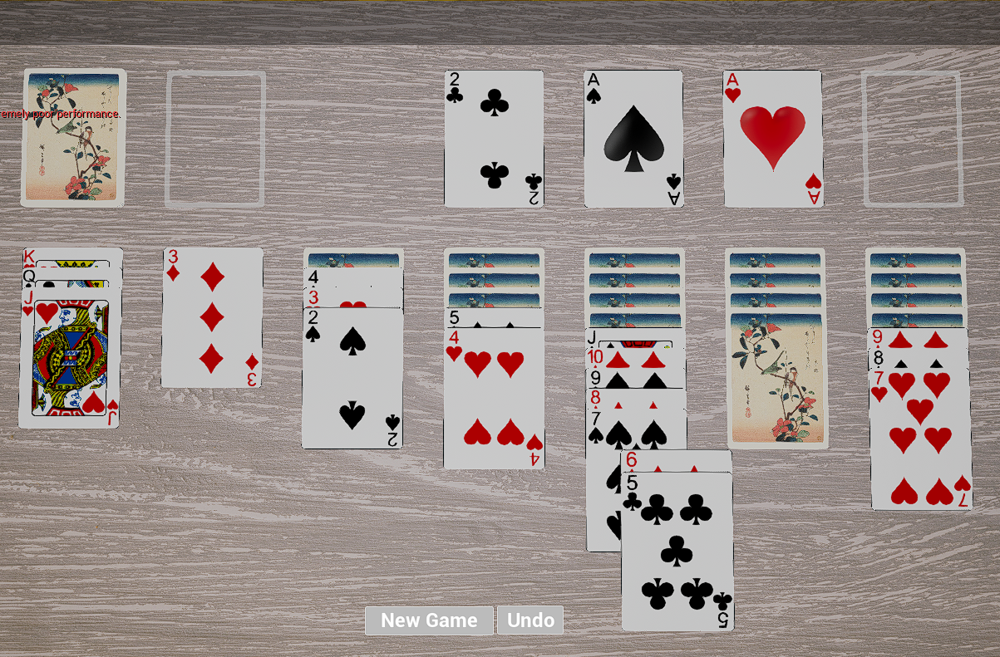

# Solitaire
A quick implementation of Klondike solitaire in Unreal 5

# Introduction

This project serves as a demonstration of my knowledge of C++ and Blueprints in Unreal Engine 5. To run the game, open the project in Unreal Editor 5.3 or later and press Play in Editor.

# Design considerations

The game logic has primarily been implemented in Blueprints for ease of experimentation. C++ is only used in places where a designer is unlikely to need access (e.g. the code movement component code) and where code is unlikely to change. This reflects my effort to maintain a data-driven approach where possible.

# Features

- Command-driven gameplay
    - Supports Undo functionality.
- Drag-and-drop interaction
    - Cards can be dragged and dropped on piles to perform actions.
- Contextual interaction
    - Clicking on a card selects an appropriate action from the list of available actions.
    - Actions are chosen using a simple scoring algorithm.

# Screenshot:

Below is a screenshot of the game. Please excuse the exhausted memory warning; my GPU is a potato.

